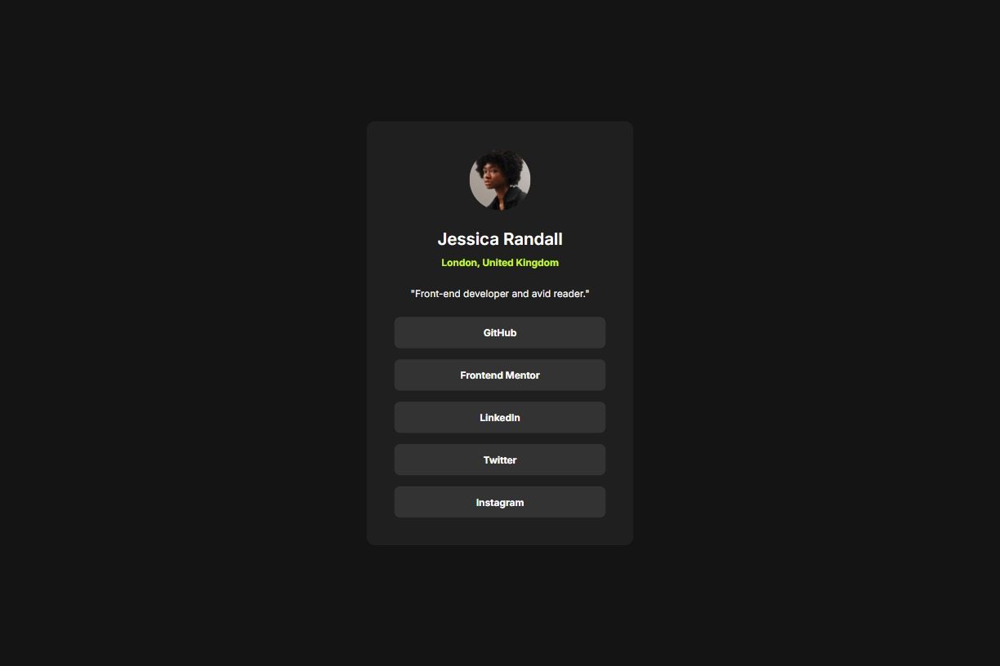

# Social Links Profile | Frontend Mentor

**Challenge 4**

This is a solution to the [Social links profile challenge on Frontend Mentor](https://www.frontendmentor.io/challenges/social-links-profile-UG32l9m6dQ). Frontend Mentor challenges help you improve your coding skills by building realistic projects.

## 📚 Table of contents

- [🔎 Overview](#-overview)
  - [🎯 The challenge](#-the-challenge)
  - [📸 Screenshot](#-screenshot)
  - [🔗 Links](#-links)
  - [🛠️ Built with](#️-built-with)
- [🧠 My process](#-my-process)
  - [🔙 Previous challenge](#-previous-challenge)
  - [🔜 Next challenge](#-next-challenge)
- [👤 About Me](#-about-me)
  - [🌐 Connect with Me](#-connect-with-me)
  - [💻 Coding Profiles](#-coding-profiles)

## 🔎 Overview

### 🎯 The challenge

Users should be able to:

- See hover and focus states for all interactive elements on the page

### 📸 Screenshot

### 🔗 Links

- [🔴 Live Demo](https://DalaScript.github.io/social-links-profile/)
- [🗂️ GitHub Repository](https://github.com/DalaScript/social-links-profile)

### 🛠️ Built with

- HTML5
- CSS3
- Flexbox
- Mobile-first workflow
- bem - [Block Element Modifier](https://getbem.com/introduction/)

## 🧠 My process

### 🔙 Previous Challenge

- Blog Preview Card | *Challenge 3* → [View Repository](https://github.com/DalaScript/blog-preview-card)

### 🔜 Next Challenge

- Product Preview Card Component | *Challenge 5* → [View Repository](https://github.com/DalaScript/product-preview-card-component)

---

## 👤 About Me

### 🌐 Connect with Me

- [Instagram](https://www.instagram.com/DalaScript)
- [YouTube](https://www.youtube.com/@DalaScript)

### 💻 Coding Profiles

- [freeCodeCamp](https://www.freecodecamp.org/DalaScript)
- [FrontendMentor](https://www.frontendmentor.io/profile/DalaScript)
- [GitHub](https://github.com/DalaScript)

*🙌 Thanks for checking out my project! More coming soon. Stay tuned 🚀*
